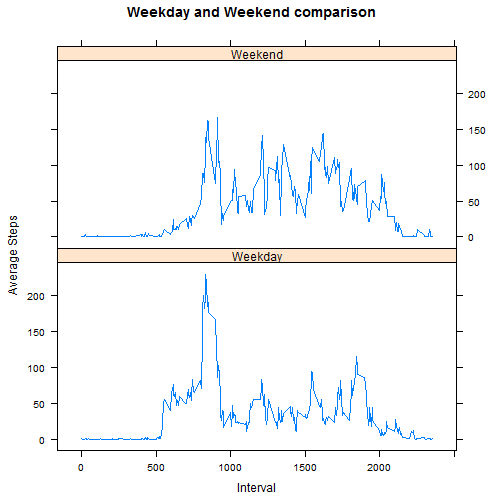

### Loading and preprocessing the data
Zip file is downloaded into working directory and unzipped (file name activity.csv)
First load Data from csv file using read.csv .Date is in character format. use as.Date for correct interpretation


```r
ActivityData <- read.csv("activity.csv")
ActivityData$date <- as.Date(ActivityData$date, "%Y-%m-%d")
```


### What is mean total number of steps taken per day?


Calculate daily totals with NAs removed .Change column names for clarity .Make Histogram of the total number of steps taken each day.

```r
StepCountByDate <- aggregate(ActivityData$steps, list(ActivityData$date), sum ,na.rm=TRUE)
colnames(StepCountByDate) <- c("Date", "Steps")
hist(StepCountByDate$Steps ,main="Histogram for steps taken each day" , xlab="Steps")
```

 
 
Calculate and report the mean and median total number of steps taken per day

```r
mean_With_NA_removed <- round(mean(StepCountByDate$Steps))
median_With_NA_removed <- round(median(StepCountByDate$Steps))
paste("Mean vaue with NA removed : " ,mean_With_NA_removed)
```

```
## [1] "Mean vaue with NA removed :  9354"
```

```r
paste("Median value with NA removed : " ,median_With_NA_removed)
```

```
## [1] "Median value with NA removed :  10395"
```
  

### What is the average daily activity pattern?
Make a time series plot (i.e. type = "l" ) of the 5 minute interval (x axis) and the average number of steps taken, averaged across all days (y axis)


```r
StepCountByInterval <- aggregate(ActivityData$steps, list(ActivityData$interval), mean ,na.rm=TRUE)
colnames(StepCountByInterval) <- c("Interval", "Steps")
plot(StepCountByInterval$Interval ,StepCountByInterval$Steps , type = "l" ,xlab="Interval" , ylab="Steps" , main="Average Steps by interval" )
```

 
  
Which 5 minute interval, on average across all the days in the dataset, contains the maximum number of steps?

```r
Interval_with_max_Steps <- StepCountByInterval[StepCountByInterval$Steps==max(StepCountByInterval$Steps),c(1)]
paste("Maximum steps are done in the interval : " ,Interval_with_max_Steps)
```

```
## [1] "Maximum steps are done in the interval :  835"
```
### Imputing missing values
Calculate and report the total number of missing values in the dataset


```r
num_rows_with_na <- nrow(ActivityData[is.na(ActivityData$steps) ,])
paste("Number of rows with missing values : " ,num_rows_with_na)
```

```
## [1] "Number of rows with missing values :  2304"
```
Devise a strategy for filling in all of the missing values in the dataset . Missing values will be populated using average of particular interval


```r
ActivityDataRevised <- ActivityData
StepCountByInterval <- aggregate(ActivityDataRevised$steps, list(ActivityDataRevised$interval), mean ,na.rm=TRUE)
colnames(StepCountByInterval) <- c("interval", "AvgSteps")
StepCountByInterval$AvgSteps <- floor(StepCountByInterval$AvgSteps)
interv <- 0
for ( i in 1:nrow(ActivityDataRevised)) {
  if (is.na(ActivityDataRevised$steps[i])) {
        interv <- ActivityDataRevised$interval[i]
        ActivityDataRevised$steps[i]<-StepCountByInterval[StepCountByInterval$interval==interv,2]
    }
}
```
Make histogram with values filled in


```r
StepCountByDate <- aggregate(ActivityDataRevised$steps, list(ActivityDataRevised$date), sum ,na.rm=TRUE)
colnames(StepCountByDate) <- c("Date", "Steps")
hist(StepCountByDate$Steps ,main="Histogram for steps taken each day" , xlab="Steps")
```

 
  
Calculate mean and median of revised data set


```r
mean_With_NA_filled <- round(mean(StepCountByDate$Steps))
median_With_NA_filled <-round(median(StepCountByDate$Steps))

paste("Mean Value with missing values filled : " ,mean_With_NA_filled)
```

```
## [1] "Mean Value with missing values filled :  10750"
```

```r
paste("Median Value with missing values filled : ",median_With_NA_filled)
```

```
## [1] "Median Value with missing values filled :  10641"
```
Compare data with NA removed and NA filled with average data for that interval

```r
    if (mean_With_NA_filled > mean_With_NA_removed  ){
        paste("Mean with data filled is higher than original. ","Original Mean : " ,mean_With_NA_removed ,"New Mean : " ,mean_With_NA_filled  )
      } else  {
      paste("Mean value with data filled is lower than or equal to original.","Original Mean : " ,mean_With_NA_removed ," New Mean : " ,mean_With_NA_filled  )
      }
```

```
## [1] "Mean with data filled is higher than original.  Original Mean :  9354 New Mean :  10750"
```

```r
   if (median_With_NA_filled > median_With_NA_removed ){
     paste ("Median with data filled is higher than original. " ,"Original Median : " ,median_With_NA_removed ," New Median : " ,median_With_NA_filled )
   } else {
     paste ("Median with data filled is lower than or equal to original. " ,"Original Median : " ,median_With_NA_removed ," New Median : " ,median_With_NA_filled )
   }
```

```
## [1] "Median with data filled is higher than original.  Original Median :  10395  New Median :  10641"
```
  
### Compare weekday and weekend pattern.
  
First add factor weekday_or_weekend and then plot using that factor

```r
ActivityDataRevised$weekday_or_weekend <- as.factor(ifelse(weekdays( ActivityDataRevised$date) %in% c("Saturday","Sunday"), "Weekend", "Weekday"))
StepCountByInterval <- aggregate(ActivityDataRevised$steps, list(ActivityDataRevised$weekday,ActivityData$interval), mean ,na.rm=TRUE)
colnames(StepCountByInterval) <- c("Weekday_Weekend","Interval", "AvgSteps")
StepCountByInterval$AvgSteps <- floor(StepCountByInterval$AvgSteps)
library(lattice)
xyplot(AvgSteps ~ Interval | Weekday_Weekend, data=StepCountByInterval , layout = c(1, 2),type="l" , ylab="Average Steps" , main="Weekday and Weekend comparison")
```

 

